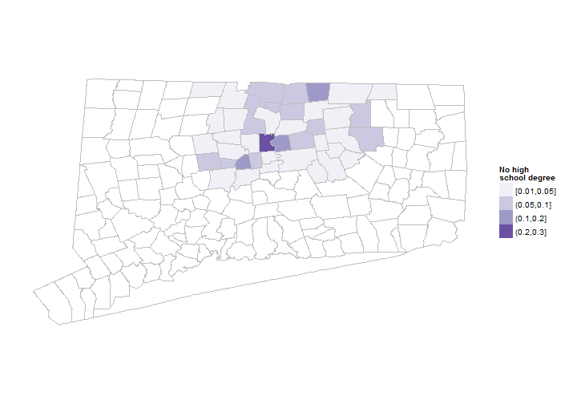
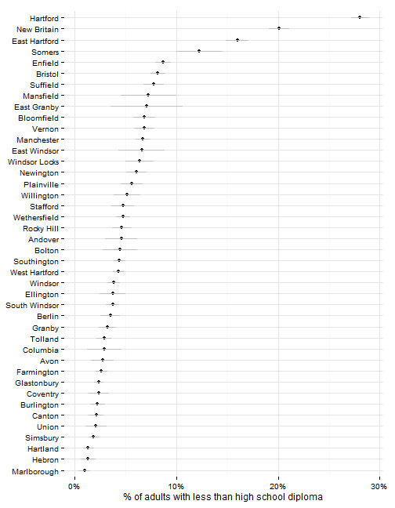
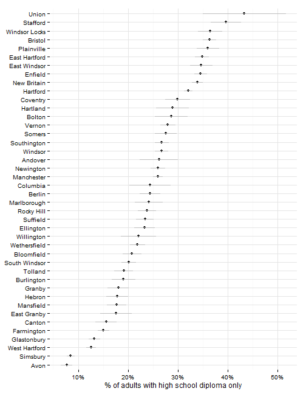
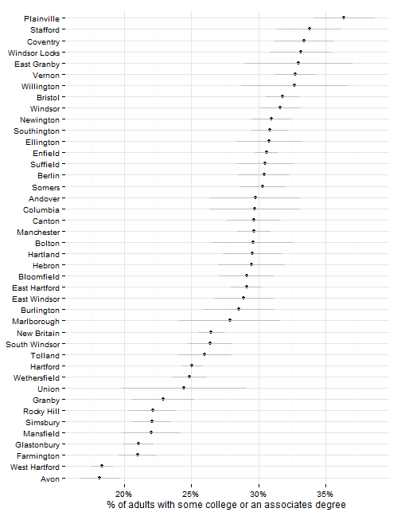
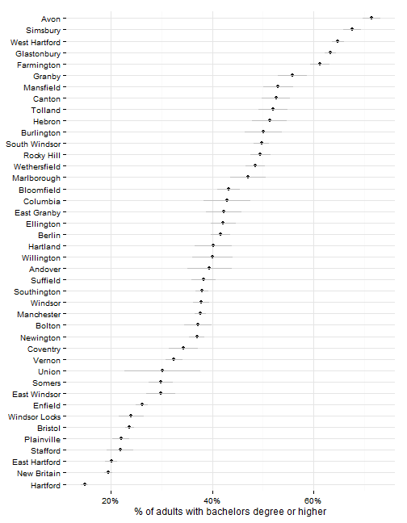
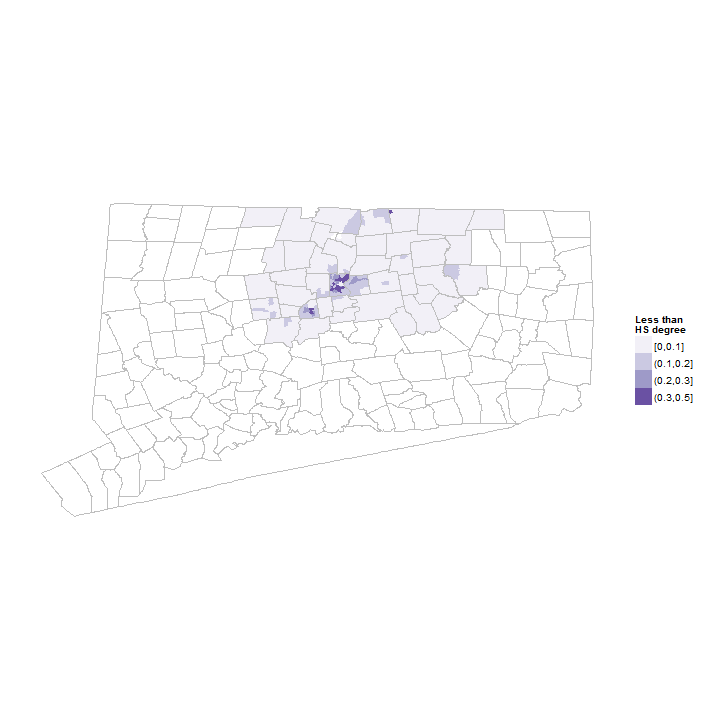
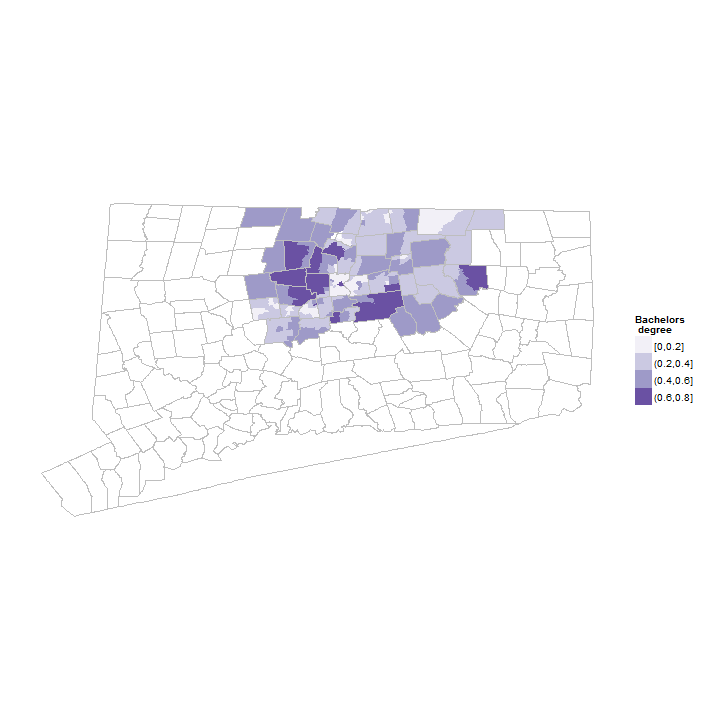

## Educational attainment indicators

This section covers indicators related to the educational attainment of Hartford area residents. 

## Data and limitations

Data on educational attainment typically comes from the U.S. Census Bureau's American Community Survey (ACS). This means that data is available with town or neighborhood-level detail, but only by combining several years of samples (3 to 5), making trend analysis difficult. 

The ACS does provide several breakouts for educational attainment - by age, by whether the individual is employed / unemployed, by nativity (US or foreign-born), etc. - although the margin of error for these subgroups increases the smaller the group. 

The ACS provides several levels of educational attainment; most indicator reports look at high-school diploma and college degree. The [four standard levels](http://factfinder2.census.gov/faces/tableservices/jsf/pages/productview.xhtml?pid=ACS_12_1YR_B23006&prodType=table) though are: 
* Less than high school graduate
* High school graduate
* Some college or associate's degree
* Bachelor's degree or higher

## What do we already know?

Educational attainment rates are among the most frequently-used indicators in local and national reports. Below are references for some, with details on how the data is used. 

### Local

* [CETC Report Card](http://www.ctdol.state.ct.us/OWC/CETC/2013ReportCard.pdf) includes the percent graduating 2 - 4 year schools with STEM degrees. 
* [CT Fair Housing Center Opportunity Mapping](http://www.ctfairhousing.org/people-place-and-opportunity-report/) includes '% of population over 25 with college degree' (including associate's degrees) as a component of their opportunity index. 
* [CWP Community Workforce Development Report Card](http://www.capitalworkforce.org/ctworks/documents/Community_Workforce_Development_Report_Card_2011ff.pdf) included both the '% of residents 25+ with high school diploma' and a separate indicator on the percent of STEM degrees conferred by Connecticut public colleges and universities. 
* [Hartford Neighborhood Assessments](http://courantblogs.com/cityline/wp-content/uploads/2013/04/Hartford-Neighborhood-Assessment.pdf) looked at adults with high-school degree and a college-degree as measures of neighborhood well-being. 
* [Health Equity Index](http://www.cadh.org/health-equity/health-equity-index.html) includes the 'Percent of adults with at least a bachelor's degree' as a component.   
* [Population Results Working Group](http://www.ct.gov/opm/cwp/view.asp?a=2998&Q=490946) cites both the % of adults with a college degree and the % with a post-secondary education as indicators to track for the state. 
* [Opportunities Hartford](http://www.cahs.org/programs-opportunitieshartford.asp) includes the number of Certificates and Associates Degrees awarded by Community Colleges as an indicator, which would be part of looking at attainment of college and associate's degrees. 
* [CT Voices for Children](http://www.ctvoices.org/) plans to include % of population over 25 with college degree as an indicator of child well-being for the Hartford region.
* [Data Haven's Community Well-Being Index](http://www.ctdatahaven.org/communityindex) includes the percent of adults with high-school degrees, bachelor's degrees and the percentmoving to the area from out-of-state or abroad who have a graduate or professional degree as well-being indicators. 

### Other relevant efforts

* [Boston Indicators Project](http://www.bostonindicators.org/) looks at the numbers of associates degrees awarded as well as those awarded by community colleges and public higher education. 
* [The Child Well-Being Index](http://fcd-us.org/our-work/child-well-being-index-cwi) includes both bachelor's and high-school degree attainment rates among it's 'Community Engagement' indicators.
* [Chicago Deparment of Public Health](https://data.cityofchicago.org/Health-Human-Services/hardship-index/792q-4jtu) includes the percent of adults with a high-school diploma as one factors in their 'Hardship index' (originally developed via the Rockefeller Institute).
* [The American Human Development Index (HDI)](http://www.measureofamerica.org/human-development/) includes educational attainment as one of three factors, looking at bachelor's and graduate degrees and high-school diplomas for the population. 
* [What Matters to Metros](http://www.futurefundneo.org/whatmatters) includes the percent of the population with: post-graduate (advanced) degrees, with bachelor's degrees born outside the United States ('international talent') and the share of STEM degrees among overall degrees as key factors for metro areas.

## Sample results

The sample results are for all towns in Hartford and Tolland Counties since it is easier to extract ACS data that way. This can be trimmed to a smaller region later though. 

By town, Hartford has the highest percent of individuals with less than a high-school education - almost 30 percent of the adult population. New Britain, East Hartford and Somers have rates that are also significantly higher than the surrounding towns. Most other towns in the region have fewer than 10 percent of adults with less than a high-school education. 

 

Since the data is drawn from the ACS, there are margins of error associated with the values, which can be large for small towns. In practice, this means we cannot effectively distinguish the levels for many towns in the region, especially small towns. 

 

The next category are those with a high-school degree only. Here, some rural towns have high rates - Union, Stafford and Windsor Locks have the highest rates in the region (although with high margins of error).

 

Those with some college education or an associate's degree are the next group, again with high rates in some rural and suburban towns. 

 

The percent with a bachelor's degree or higher is highest in the more affluent towns in the region - Avon, Simsbury, West Hartford, Glastonbury and Farmington all have above 60 percent of adults with a bachelor's degree. Hartford, by comparison, has fewer than 15 percent of adults with a bachelor's degree.  

 

The ACS data can be looked at by neighborhood (for 5-year estimates); below are maps of the region for those with a bachelor's degree and those with less than a high-school education. 

 

Adults with a bachelor's degree or higher; the map shows some more detail than by town (for instance, most college-educated adults in Hartford live downtown). 

 

